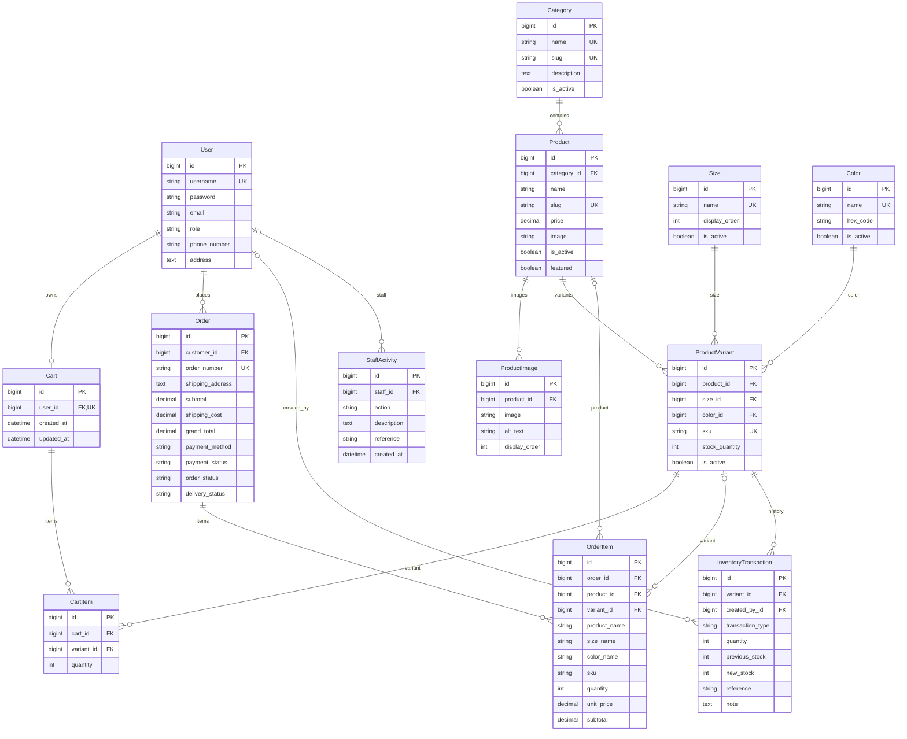

# Entity relationship diagram

This diagram represents the custom business models in the inspected `models.py` files. Fields shown are selected real stored fields, not an exhaustive schema. `id` is Django's automatic primary key. `_id` names represent the database columns for actual foreign-key fields. Mermaid types are simplified logical types. User is `accounts.User`, extending Django AbstractUser.

## Relationship explanations

| Relationship | Cardinality and deletion behavior |
| --- | --- |
| User → Cart | A user has zero or one cart; every cart has exactly one user. OneToOneField with CASCADE. |
| User → Order | A user can have many orders; every order requires one customer. ForeignKey with PROTECT. The field itself does not restrict the user's role at database level. |
| User → InventoryTransaction | A user can create many inventory records; created_by is optional and uses SET_NULL. |
| User → StaffActivity | A user can be referenced by many activities; staff is nullable and uses SET_NULL. The name does not impose a database role constraint. |
| Category → Product | A category can contain many products; every product requires one category. PROTECT. |
| Product → ProductImage | A product can have many gallery images; every image belongs to one product. CASCADE. |
| Product → ProductVariant | A product can have many variants; every variant belongs to one product. CASCADE, subject to other protected dependencies. |
| Size → ProductVariant | A size can be used by many variants; every variant requires one size. PROTECT. |
| Color → ProductVariant | A color can be used by many variants; every variant requires one color. PROTECT. |
| Cart → CartItem | A cart can contain many items; every item requires one cart. CASCADE. |
| ProductVariant → CartItem | A variant can appear in many carts; each cart item requires one variant. PROTECT. A cart/variant pair is unique. |
| Order → OrderItem | An order can have many item records; every item requires one order. CASCADE. Checkout creates at least one item, but the foreign key does not enforce that minimum. |
| Product → OrderItem | A product can be referenced by many historical items; the product link is optional and uses SET_NULL. |
| ProductVariant → OrderItem | A variant can be referenced by many historical items; the variant link is optional and uses SET_NULL. Stored snapshot values preserve history. |
| ProductVariant → InventoryTransaction | A variant can have many stock-history entries; every entry requires one variant. PROTECT. |

ProductVariant additionally has a unique constraint on `(product, size, color)`. OrderItem's product and variant are separate foreign keys; the schema does not define a composite foreign-key constraint between them. Checkout assigns consistent references.

InventoryTransaction.reference and StaffActivity.reference are strings, often containing an order number or SKU. They are not relational foreign keys. There is no Payment model or separate Customer/Staff/Owner entity. Inherited Django auth group/permission relationships and framework tables are outside this business diagram; see [Database design](DATABASE.md).
