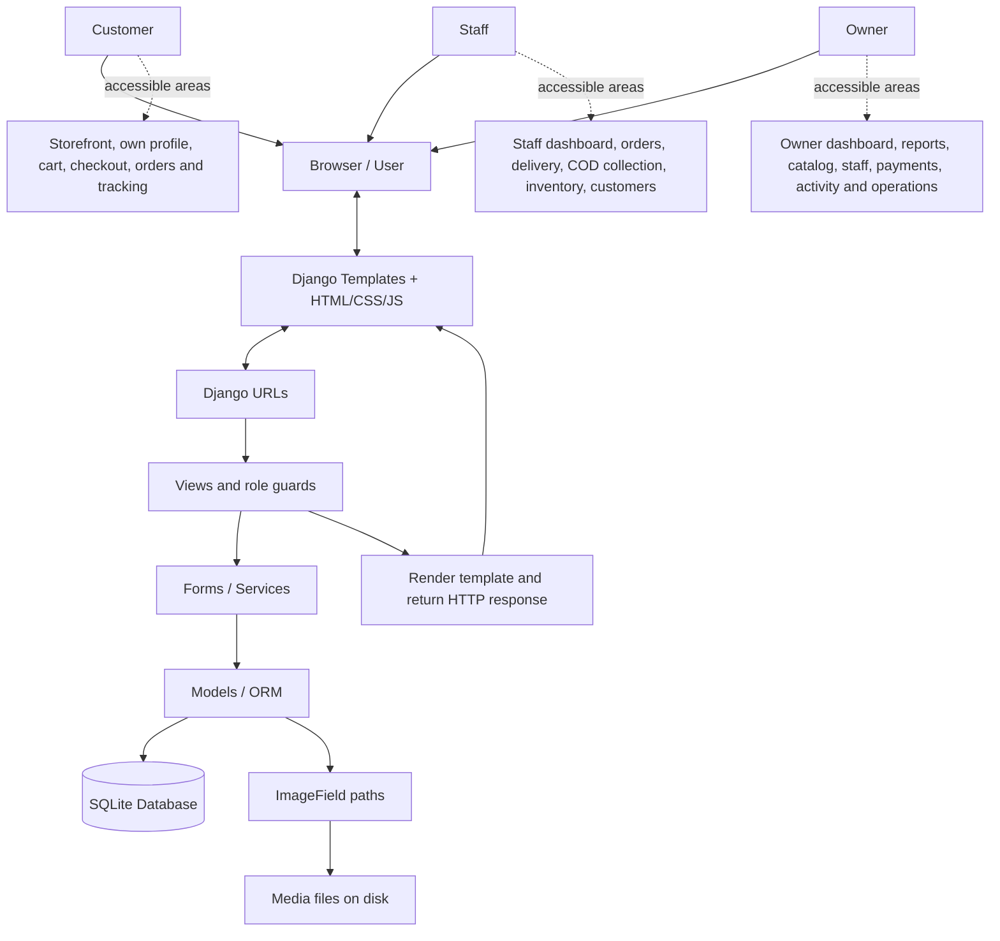

# System architecture

BRAMANDA is a server-rendered Django application. Customer, staff, and owner interfaces share one project and one SQLite database. The following diagram shows the main logical layers; it does not imply that browser requests pass through a template before URL resolution.

## Request and response cycle

1. The browser sends an HTTP request, such as GET `/shop/` or POST `/checkout/`.
2. Django middleware handles sessions, authentication, CSRF checks, and other request processing. Root and app URL configurations resolve the request to a view.
3. The view checks authentication, ownership, and role requirements as appropriate. It reads query parameters for searches or sends submitted input to a form.
4. Forms validate allowed fields. Checkout calls `orders.services.create_order_from_cart`; stock changes call `inventory.services.adjust_stock`. Simple reads and some edits use the ORM directly in views/forms.
5. The ORM reads or writes SQLite records. Transactions group related writes into an all-or-nothing operation.
6. The view renders a Django template or redirects after a successful mutation. The browser receives HTML and uses CSS/JavaScript for layout and interaction.

## Separation of responsibilities

URLs decide which handler runs. Views coordinate each request. Forms protect input boundaries. Services hold reusable multi-record business operations. Models define stored data and relationships. Templates present the results. This separation makes the application easier to explain, test, and maintain.

The owner and staff dashboards are implemented in the same dashboard app with distinct routes and guards. Owners reuse staff order, inventory, and customer views under an additional owner guard. Payment overview queries Order records; the payments app has no separate transaction model or gateway implementation.

## Consistency and access control

Checkout validates current product availability, prices, quantities, and stock, writes order/item snapshots, deducts stock with ledger records, and clears the cart inside one transaction. An error rolls back those changes together. `select_for_update` is used in services, but SQLite lacks row locks; stock updates also compare the previous quantity before writing to avoid a stale overwrite.

Role checks run on the server. A hidden navigation link alone is not authorization. Customers' order lookups are scoped to their own account, staff routes require STAFF or OWNER, and owner routes require OWNER. Django admin privileges are a separate mechanism.

## Viva explanation

“BRAMANDA uses Django to receive browser requests, validate users and input, and read or update SQLite through the ORM. Templates generate the pages. The application separates customer shopping, staff fulfillment, and owner management using explicit role checks. Checkout preserves order snapshots and stock history together in a transaction, so a failed checkout cannot leave a partial purchase.”

Static assets and uploaded images are stored as files rather than database image blobs. The checked-in configuration is a local development setup; a production deployment topology is not defined in the repository.
