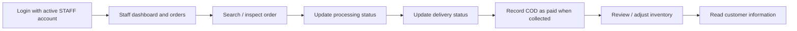
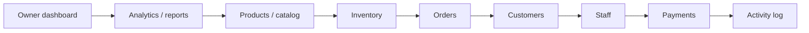

# Application workflows

## Customer

```mermaid
flowchart LR
    A[Register / Login] --> B[Browse and search products]
    B --> C[Select size/color variant and quantity]
    C --> D[Cart]
    D --> E[Checkout with shipping details and COD]
    E --> F[Confirmed order created]
    F --> G[Stock reduced and inventory history written]
    G --> H[Cart cleared and confirmation shown]
    H --> I[Order history and tracking]
```

Public browsing is available without login. Registration creates a CUSTOMER and logs the user in. Adding a product while anonymous redirects to login with a return destination; it does not create a guest cart. Each selected size/color combination identifies a ProductVariant with its own SKU and stock.

Cart operations validate activity and available stock, but do not reserve or reduce inventory. Checkout prefills profile details, accepts COD, and revalidates current database prices and stock. Shipping is fixed at Rs. 100.00. A successful checkout creates an order with CONFIRMED order status, PENDING payment status, and PENDING delivery status. It stores product/variant names and prices as OrderItem snapshots.

Order creation, inventory deductions, ledger writes, and cart clearing are one transaction. If input, stock, or a later write fails, the purchase is rolled back. The customer sees only their own order history, confirmation, and detail pages. Tracking is derived from order and delivery status; it is not a courier-location feed.

## Staff

These areas can be visited independently; the diagram is a typical working sequence. Staff can inspect all operational orders, update order/delivery status, and mark COD payment PAID. Status changes create StaffActivity records when the value changes. Status forms validate choices but do not implement a strict next-stage transition engine or automatic courier integration.

Staff inventory lists active variants with product/SKU search and stock-level labels. An adjustment requires a nonzero signed integer and a note, cannot make stock negative, and creates both InventoryTransaction and StaffActivity within an atomic operation. Customer information is read-only and includes order counts. Staff cannot manage catalog or staff accounts through the owner routes.

Order cancellation through the status form does not automatically restore stock. Return stock must be handled through an explicit inventory operation; the service supports RETURN, while dashboard adjustments use ADJUSTMENT. Order, delivery, and payment status fields are separate; updating one does not automatically synchronize the others.

## Owner

An active OWNER may use the owner areas in any order and may also access the staff dashboard. Catalog management creates/edits/activates/deactivates products, categories, sizes, colors, and variants. Product image upload is supported; the owner catalog does not expose separate ProductImage gallery management routes. New variants start at zero stock and receive stock through inventory adjustments. Owners can adjust inactive variants too.

Owners create STAFF accounts, edit basic staff information, and activate/deactivate them. These forms cannot grant OWNER or Django privilege flags. Customer lists remain read-only. Operational order actions reuse staff logic and create activity records. The payment overview reads amounts, method, and status from orders; it does not process digital payments.

## Reports and activity interpretation

- Revenue and average order value use PAID, non-CANCELLED orders and include shipping through `grand_total`.
- Report order count excludes cancelled orders; delivered and cancelled counts are shown separately. Date filters are inclusive and use the configured local date (UTC in settings).
- Best sellers sum OrderItem quantity and stored item subtotal for non-cancelled orders, including unpaid orders; item revenue excludes shipping.
- Dashboard total/paid order counts follow their direct status queries and can differ from report counts by definition.
- Low-stock alerts cover active variants with quantities 1–5; zero is out of stock.
- StaffActivity records order, delivery, payment, and inventory actions. Catalog and staff-account edits are not covered by this activity model. References are text, not foreign keys to orders.
